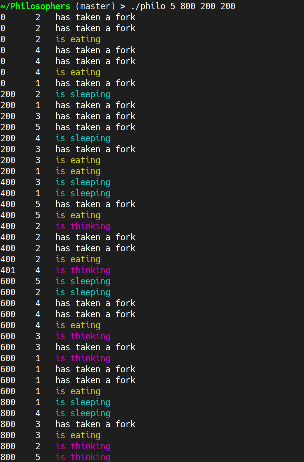

## Philosophers

The Philosophers project simulates the classic Dining Philosophers problem, with a focus on concurrency and resource management.
By leveraging threads (or processes in the bonus part) and synchronization tools like mutexes and semaphores,
the program ensures that philosophers can take turns eating, thinking, and sleeping without starving.
This project is an applied exercise in threading, process synchronization, and deadlock avoidance.

<td></td>

## Usage

**Run the Binary**: Execute the `philosophers' binary with 4 or fives numerical parameters.

## Parameters

The `philosophers` program requires the following parameters:

- **`number_of_philosophers`**: The number of philosophers and forks at the table. For example, `5` for five philosophers.
- **`time_to_die`**: The maximum time in milliseconds that a philosopher can go without eating before dying. For example, `800` milliseconds.
- **`time_to_eat`**: The time in milliseconds that a philosopher spends eating. For example, `200` milliseconds.
- **`time_to_sleep`**: The time in milliseconds that a philosopher spends sleeping. For example, `200` milliseconds.
- **`number_of_times_each_philosopher_must_eat`** (optional): If specified, the simulation ends when each philosopher has eaten this many times. If omitted, the simulation stops when a philosopher dies.

### Example

To run the simulation with 5 philosophers, where each philosopher dies if they don't eat within 800 milliseconds, spends 200 milliseconds eating, and 200 milliseconds sleeping:

```bash
./philosophers 5 800 200 200
